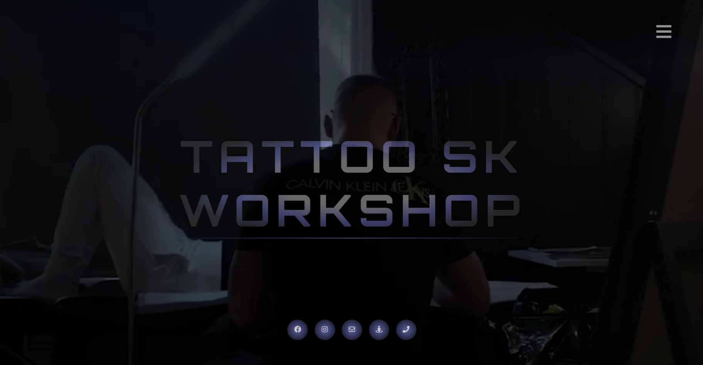

# TATTOO SK WORKSHOP

## [View the live project here.](https://tattooskworkshop.no/)

# [&#8686;](#TATTOO-SK-WORKSHOP)
## ***Introduction***
This Full Stack Django project was created for a Tattoo artist business in Norway. 

Features backend functionality allowing admin to store and manage a picture gallery and website content.

The website is translated into two languages English and Norwegian, using Django (i18n) and localization functionality.

Combined with Nginx as a web server efficiently serve static files.

Github repository: https://github.com/Raivis80/django-workshop-app

Live Site: https://tattooskworkshop.no

Main Technologies: HTML, CSS, JavaScript, Python+Django, Nginx

# [&#8686;](#TATTOO-SK-WORKSHOP)
## ***UX*** 
### **User Stories**
#### External Visitor goals
1. Easy to navigate the website and to locate information about products and services.
1. To be able to connect with Tattoo artist on Social media.
1. To be able contact for session or consultation appointment.
1. To locate easily Contact and support details.

#### Site owner goals
1. Drive new customers to the website and retain existing costumers.
1. Build trust with customers - Providing with social media links.
1. Customer Support – Improve customer satisfaction through better service.
1. Owner's backend management interface for content management.

# [&#8686;](#TATTOO-SK-WORKSHOP)
### **Strategy**
#### The website needs to enable the User to:
1. Easy navigate and find the styles that they are interested in.
1. Easily select the Tattoo styles that user wishes to.
1. Contact business for Booking a Tattoo session/consultation.
1. Stay connected with the company via Social media links.
1. To locate the map and address for the tattoo shop location.

#### The website needs to enable the company to:
1. Be as unique as possible, clearly defining aesthetic with engaging and descriptive photography.
1. Showcase brand, website needs to have good images.
1. Stay connected with customers by providing social media links.
1. To enable Site Owner to update existing Photography and/or content.
1. Provide the customers with contact information and support.
1. Enable customers to find the business by providing with shop location and map.

# [&#8686;](#TATTOO-SK-WORKSHOP)
### **Scope**
#### Functionality Requirements
1. Interactive website Navigation.
1. Website Hero image/video.
1. Interactive thumbnail image gallery.
1. Social Media links to external resources.
1. Customer Support contact form.

#### Content Requirements
1. Landing Page scroll down function:
   - Video Full size Darkened.
   - Interactive elements within landing page.
   - Book a session links
   - Links to social media sites
1. About The company
   - About Company
   - Contact and address
1. About artist
 - Artist description
 - Artist Profile image
 - Artist gallery carousel with latest work display
 - link to artist gallery
1. Thumbnail gallery for individual artist
   - Back end management for owner to be able to manage the gallery.
1. Contact Form
   - Name input field
   - Email input field
   - Text area 
   - Submit button 
1. Contact us
   - Contact information (email, telephone munber...)
   - Link to contact form 
   - Social Media Links
1. Back end Admin Page
   - Upload,delete,edit the gallery and manage content

# [&#8686;](#TATTOO-SK-WORKSHOP)
## **Technologies and Frameworks**

### **Markup/Scripting/Programming languages**
- [HTML5](https://en.wikipedia.org/wiki/HTML5) Hypertext Markup Language (HTML)
- [CSS3](https://en.wikipedia.org/wiki/Cascading_Style_Sheets) Cascading Style Sheets (CSS)
- [JavaScript](https://www.javascript.com/) Interactive functionality.
- [Python](https://www.python.org/) Python for backend development

### **Frameworks, Libraries & Programs Used**
- [Google Fonts:](https://fonts.google.com/) Making the web more beautiful.
- [Font Awesome:](https://fontawesome.com/) to add icons to the website..
- [Git](https://git-scm.com/) Git was used for version control.
- [GitHub:](https://github.com/) used to store the projects code.
- [gitpod.io](https://gitpod.io/) gitpod Was used for codding.
- [VS Code](https://code.visualstudio.com/) gitpod Was used for codding.
- [Balsamiq:](https://balsamiq.com/) was used to create the wireframes.
- [django framework](https://www.djangoproject.com/) Django high-level Python framework.

### **Content**
- The [Font Awesome:](https://fontawesome.com/) icons where used throughout the project.
Start Bootstrap template uset to start this project projects.

-https://startbootstrap.com
Start Bootstrap was created by and is maintained by David Miller.

https://davidmiller.io
https://github.com/davidtmiller
Start Bootstrap is based on the Bootstrap framework created by Mark Otto and Jacob Thorton.

# [&#8686;](#TATTOO-SK-WORKSHOP)
